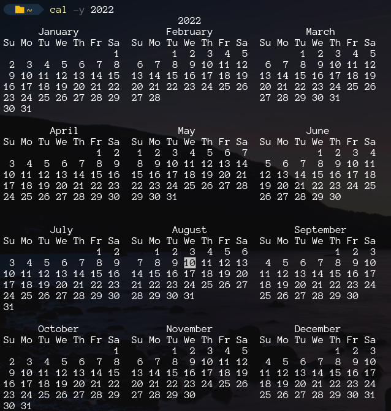
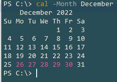

# PSCal
A PowerShell module to display a Linux-like calendar in the console.

## Preview


## Installation

1. Run PowerShell as Administrator
2. Execute the following command:
    ```pwsh
    Install-Module PSCal
    ```

## Usage

```pwsh
$ Show-Calendar [[-Year] <Int32>] [[-Month] <String>] [<CommonParameters>]        
```
or simply:
```pwsh
$ cal -y <yyyy> -m <month name(first letter should be capitalized)> 
```
### Examples
> Displaying calendar of current date
```pwsh
$ cal
```
> Displaying the 1997 calendar from January to December
```pwsh 
$ cal -y 1997
```
>Displaying a calendar for a specific month(March)
```pwsh
$ cal -m March
```
>Displaying the March 1997 calendar
```pwsh
$ cal -m March -y 1997
```

## Adding custom holidays

### Preview


### Steps
1. Go to the directory where the `PSCal` module is installed.
2. Edit `holiday.txt` and add the dates for the holidays in the format of `yyyy/mm/dd`.
3. Save it.

## Credits
Copyright © 2021 
[imanedr](https://github.com/imanedr). All rights reserved.
